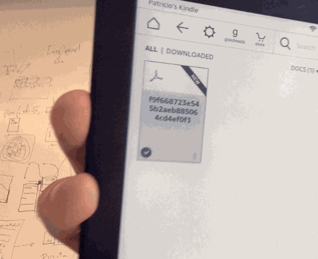

# FieldGuide

Given a Valhalla route request construct a PDF using [Paparazzi's static maps](https://github.com/tangrams/paparazzi) ready to be send to a PaperWhite Kindle through their own [email-to-kindle service](https://www.amazon.com/gp/sendtokindle/email)

## Acknowledgements

- [Hanbyul](https://twitter.com/hanbyul_here) is responsable for the awesome interactive website that puts together [Tangram](https://mapzen.com/products/tangram/) + [Mapzen Search](https://mapzen.com/products/search/?lng=-73.98073&lat=40.72606&zoom=12) + [Mapzen Turn-by-Turn](https://mapzen.com/products/turn-by-turn/?d=0&lat=40.7259&lng=-73.9805&z=12&c=multimodal&st_lat=37.839682&st_lng=-122.485284&st=Vista%20Point&end_lat=37.80927&end_lng=-122.25981&end=Fairyland&use_bus=0.5&use_rail=0.6&use_transfers=0.4&dt=2016-09-20T08%3A00&dt_type=1) in a single [map here](https://github.com/mapzen/lrm-mapzen)

- [Geraldine Sarmiento](https://twitter.com/sensescape) is responsable for the beatiful and minimalistic [Refill Style for tangram maps](https://github.com/tangrams/refill-style)

